# NormCode: An Engine for Building Reasoning Agents

NormCode is a comprehensive framework for building and running intelligent agents that can understand natural language and execute complex, structured plans. At its core is **NormCode**, a declarative language designed to represent tasks not as rigid scripts, but as flexible "plans of inferences."

The standout feature of this project is its ability to translate high-level, natural language descriptions of a task directly into an executable NormCode plan. This allows developers to create sophisticated agents with emergent reasoning capabilities.

This repository contains the complete ecosystem for NormCode, including:
- The core **`infra` Engine** for executing NormCode plans.
- A web-based **`editor_app`** for creating, visualizing, and debugging plans.
- A **`translate_agent`** that can convert natural language into NormCode.
- A **Streamlit App** (`streamlit_app/`) for running orchestrations via web UI.
- A **CLI Tool** (`cli_orchestrator.py`) for running orchestrations from command line.

## How It Works: A Visual Workflow

The following diagram illustrates the end-to-end workflow of the NormCode ecosystem:

```mermaid
graph TD
    A["Input <br> (Natural Language Task)"] --> B["translate_agent"];
    B -- Translates --> C["NormCode Plan"];
    C <--> D["editor_app <br> (View / Edit / Debug)"];
    C --> E["infra Engine"];
    E -- Orchestrates --> F["Execution"];
    subgraph Execution Context
        F --> G["🧠 Foundation Models"];
        F --> H["⚙️ Tools & Data"];
    end
    F --> I["Output <br> (Final Result)"];
```



## The NormCode Ecosystem

The project is built on three main pillars that work together to provide a complete development and execution environment. Inspired by the concept of an "Alignment Stack," these layers ensure that the agent's actions are aligned with the user's intent and grounded in real-world context.


### 1. The `infra` Engine: The Core Executor

The `infra` directory contains the heart of the project: the NormCode execution engine. It's responsible for taking a plan of inferences and orchestrating its execution. Key components include:

-   **Orchestrator**: The central conductor that manages the execution flow.
-   **Blackboard**: A shared memory space that tracks the real-time state of every concept and inference in the plan.
-   **Agent's Sequences**: Pre-defined pipelines that execute the logic for different types of inferences (e.g., looping, making judgments, or running code).
-   **Body**: An interface for interacting with external tools, most notably Large Language Models (LLMs).

For a deep dive into the theory and syntax of NormCode, please see the [**NormCode Guide**](documentation/NormCode_terms/NormCode_Guide.md).

### 2. The `editor_app`: A Web-Based IDE

To make working with NormCode intuitive, the project includes a powerful web-based IDE. The editor provides a graphical interface for:

-   Creating and modifying NormCode plans.
-   Visualizing the relationships between different inferences.
-   Debugging plan execution in real-time.

The editor is built with a React frontend and a FastAPI backend, providing a modern and responsive development experience.

### 3. The `translate_agent`: Natural Language to NormCode

Perhaps the most powerful component of the ecosystem is the `translate_agent`. This agent is capable of taking a high-level, natural language description of a task and translating it into a structured, executable NormCode plan.

This translation process is not based on simple heuristics; it follows a formal, structured algorithm detailed in the [**Comprehensive NormCode Translation Guide**](direct_infra_experiment/translation_experiment/comprehensive_normcode_translation_guide.md). This allows the system to reason about how to break down a problem and formulate a plan to solve it.

## Getting Started

This section will guide you through setting up the project and running your first examples.

### 1. Installation

The core `infra` engine has minimal dependencies. To get started, clone the repository and install the required packages:

```bash
git clone https://github.com/your-username/normCode.git
cd normCode
pip install -r requirements.txt
```

### 2. Running a Basic Example

The easiest way to see NormCode in action is to run one of the included examples. The `ex_add_complete.py` script demonstrates a NormCode plan that performs multi-digit addition.

To run it:

```bash
python infra/examples/add_examples/ex_add_complete.py
```

This will execute the plan and output the final result. You can inspect the script to see how the NormCode plan is defined and how the `Orchestrator` is used to run it.

### 3. Running the LLM-Powered Example

A more advanced example, `ex_add_complete_code.py`, showcases the framework's ability to integrate with Large Language Models (LLMs). In this example, some of the inference steps are not hard-coded but are instead executed by an LLM that generates and runs Python code on the fly.

To run this example, you will first need to set up your OpenAI API key. Create a `.env` file in the root of the project:

```
OPENAI_API_KEY="your-api-key-here"
```

Then, run the script:

```bash
python infra/examples/add_examples/ex_add_complete_code.py
```

### 4. Using the Streamlit Orchestrator App

For a quick and easy way to run orchestrations, we provide a minimal Streamlit web app:

```bash
cd streamlit_app
pip install streamlit
streamlit run app.py
```

This provides a web interface to:
- Upload repository JSON files (concepts, inferences, inputs)
- Configure execution parameters
- Start/resume orchestrations with checkpointing
- View results and execution history

See [**streamlit_app/README.md**](streamlit_app/README.md) for detailed instructions.

### 5. Launching the Editor

The `editor_app` is a powerful web-based IDE for working with NormCode. It has its own set of dependencies and requires a separate setup process for its FastAPI backend and React frontend.

Please see the [**Editor README**](editor_app/README.md) for detailed setup and launch instructions.

## Project Structure

The repository is organized into the following key directories:

-   `infra/`: The core NormCode execution engine and its components.
-   `editor_app/`: The source code for the web-based IDE (frontend and backend).
-   `translate_agent/`: The agent responsible for translating natural language into NormCode.
-   `direct_infra_experiment/`: Contains research, experiments, and documentation related to the translation agent.
-   `documentation/`: Contains high-level documentation, including the main NormCode guide. 