# NormCode: Context-Isolated AI Planning

**NormCode is a semi-formal language for building auditable, multi-step AI workflows where each step sees only what you explicitly pass to it.**

---

## The Problem: Context Pollution

When you chain multiple LLM calls together, **context pollution** causes failures:

```
Step 1: Read a 50-page document
Step 2: Extract key entities  
Step 3: Cross-reference with database
Step 4: Generate summary
        ↑ Why is this hallucinating names that don't exist?
```

By step 4, the model has 50 pages of document, raw database results, and extraction metadata all swimming in context. It hallucinates because it's drowning in noise.

**Current approaches offer limited defense:**
- Direct prompting bundles everything into one context window → cognitive overload
- Chain-of-Thought extends interaction but doesn't isolate context → errors leak forward
- Agent frameworks like LangChain provide orchestration but leave data flow implicit → debugging in the dark

---

## The Solution: The Alignment Stack

NormCode is part of a three-layer framework that bridges AI capabilities with real-world goals:

```
┌─────────────────────────────────────────────────────────┐
│  NormCode                    (Alignment Layer)          │
│  Semi-formal contracts between humans and AI            │
├─────────────────────────────────────────────────────────┤
│  Shared Workspace            (Contextualization Layer)  │
│  Data, tools, and constraints for specific tasks        │
├─────────────────────────────────────────────────────────┤
│  Foundation Models           (Intelligence Layer)       │
│  General-purpose reasoning and generation               │
└─────────────────────────────────────────────────────────┘
```

**NormCode's core guarantee:** Each inference is a sealed room. It only sees what you explicitly pass in.

---

## What Makes NormCode Different

### 1. Data Isolation by Construction

```ncds
<- risk assessment
    <= evaluate legal exposure based on the extracted clauses
    <- relevant clauses
        <= extract clauses related to liability
        <- full contract
```

The risk assessment **cannot see the full contract**. Only the extracted clauses. No confusion, reduced hallucination, fully auditable.

### 2. Semantic vs. Syntactic Separation

| Type | LLM? | Cost | Determinism | Examples |
|------|------|------|-------------|----------|
| **Semantic** | ✅ Yes | Tokens | Non-deterministic | Reasoning, generating, analyzing |
| **Syntactic** | ❌ No | Free | 100% Deterministic | Collecting, selecting, routing |

A typical 20-step plan might only call an LLM 8 times. The rest are instant, free data operations.

### 3. Three Properties for Trust

| Property | Description |
|----------|-------------|
| **Readable** | Humans can understand and audit every step |
| **Executable** | AI can act on plans consistently and reliably |
| **Accountable** | Every action is traceable with unique flow indices |

---

## The Ecosystem

```mermaid
graph TD
    A["Natural Language Task"] --> B["Compiler"]
    B --> C["NormCode Plan (.ncd)"]
    C <--> D["Canvas App (Visual Debugger)"]
    C --> E["Orchestrator"]
    E --> F["Execution"]
    F --> G["🧠 Foundation Models"]
    F --> H["⚙️ Tools & Data"]
    F --> I["Final Result + Audit Trail"]
```



### Core Components

| Component | Purpose |
|-----------|---------|
| **`infra/`** | The NormCode execution engine (Orchestrator, Blackboard, Agent Sequences) |
| **`canvas_app/`** | Visual graph debugger with React Flow, breakpoints, and real-time execution |
| **`cli_orchestrator.py`** | Command-line interface for running and managing orchestrations |
| **`documentation/`** | Comprehensive guides, grammar reference, and API documentation |

---

## Quick Start

### 1. Installation

```bash
git clone https://github.com/your-username/normCode.git
cd normCode
pip install -e .
```

### 2. Launch the Canvas App (Recommended)

The **Canvas App** is a visual debugger for executing and inspecting NormCode plans:

```bash
python launch_canvas.py
```

This automatically:
- Checks and installs Python dependencies (FastAPI, uvicorn, etc.)
- Checks and installs Node.js dependencies (React, Vite, etc.)
- Starts backend (port 8000) and frontend (port 5173)

**Options:**
```bash
python launch_canvas.py --prod       # Production mode (no auto-reload)
python launch_canvas.py --skip-deps  # Skip dependency checks (faster startup)
python launch_canvas.py --help       # Show all options
```

**Prerequisites:** Python 3.11+, Node.js 18+

### 3. Run from Command Line

For headless execution, use the CLI orchestrator:

```bash
# Start a new run
python cli_orchestrator.py run --concepts path/to/concepts.json --inferences path/to/inferences.json

# Resume from checkpoint
python cli_orchestrator.py resume --run-id <UUID>

# Fork from a past state
python cli_orchestrator.py fork --from-run <UUID> --concepts new_concepts.json

# List all runs
python cli_orchestrator.py list-runs
```

### 4. Run a Basic Example

See NormCode in action with the base-X addition algorithm (achieves 100% accuracy on arbitrary-length inputs):

```bash
python infra/examples/add_examples/ex_add_complete.py
```

---

## How It Works

### A Simple Plan

```ncds
<- document summary
    <= summarize this text
    <- clean text
        <= extract main content, removing headers
        <- raw document
```

Read bottom-up:
1. Start with `raw document`
2. Run `extract main content...` → produces `clean text`
3. Run `summarize this text` → produces `document summary`

**Key insight:** The summarization step literally cannot see the raw document.

### The Compilation Pipeline

```
Natural Language → .ncds (draft) → .ncd (formal) → .concept.json + .inference.json → Execution
```

| Phase | Output | Purpose |
|-------|--------|---------|
| **Derivation** | `.ncds` | Extract structure from natural language |
| **Formalization** | `.ncd` | Add flow indices, sequence types, bindings |
| **Post-Formalization** | `.ncd` (enriched) | Add paradigms, resources, axis annotations |
| **Activation** | JSON repositories | Generate executable format for orchestrator |

### Execution Model

The Orchestrator runs plans with:
- **Dependency-driven scheduling** — inferences run only when inputs are ready
- **SQLite checkpointing** — pause, resume, or fork from any cycle
- **Full state tracking** — inspect what each step saw and produced

---

## When to Use NormCode

| Scenario | Use NormCode? | Rationale |
|----------|---------------|-----------|
| Multi-step workflow (5+ LLM calls) | ✅ Yes | Isolation and debuggability pay off |
| Auditable AI (legal, medical, finance) | ✅ Yes | You must prove what each step saw |
| Long-running, resumable workflows | ✅ Yes | Built-in checkpointing |
| Quick prototype (1-2 LLM calls) | ❌ No | Overhead exceeds benefit |
| Simple Q&A chatbot | ❌ No | Just prompt the model directly |

**Sweet spot:** Complex, multi-step workflows where you need to know exactly what happened at each step—and where a failure at step 7 shouldn't corrupt reasoning at step 12.

---

## Project Structure

```
normCode/
├── infra/                    # Core execution engine
│   ├── _agent/               # Agent framework and sequences
│   ├── _orchest/             # Orchestrator and blackboard
│   ├── _states/              # Reference system and tensors
│   └── examples/             # Working examples
├── canvas_app/               # Visual debugger (React + FastAPI)
│   ├── frontend/             # React Flow graph visualization
│   └── backend/              # Execution controller API
├── documentation/            # Comprehensive documentation
│   ├── current/              # Latest guides
│   └── paper/                # Academic paper draft
├── cli_orchestrator.py       # Command-line interface
├── launch_canvas.py          # One-command Canvas App launcher
└── settings.yaml             # LLM API configuration
```

---

## Configuration

Create `settings.yaml` in the project root (see `canvas_app/settings.yaml.example`):

```yaml
llm:
  provider: openai  # or: anthropic, dashscope
  api_key: your-api-key-here
  model: gpt-4o     # or: claude-3-opus, qwen-plus
```

---

## Documentation

| Guide | Description |
|-------|-------------|
| [Overview](documentation/current/1_intro/overview.md) | What NormCode is and why it exists |
| [NCD Format](documentation/current/2_grammar/ncd_format.md) | The formal syntax reference |
| [Execution](documentation/current/3_execution/overview.md) | How plans run at runtime |
| [Compilation](documentation/current/4_compilation/overview.md) | The transformation pipeline |
| [Canvas App](documentation/current/5_tools/canvas_app_overview.md) | Visual debugger guide |

---

## Research

NormCode is described in the paper:

> **NormCode: A Semi-Formal Language for Context-Isolated AI Planning**
> 
> Multi-step workflows that chain LLM calls suffer from context pollution. NormCode enforces explicit data isolation as a language-level constraint, making AI workflows auditable by construction.

See [documentation/paper/paper_draft.md](documentation/paper/paper_draft.md) for the full draft.

---

## License

[Add your license here]

---

## Contributing

[Add contribution guidelines here]
