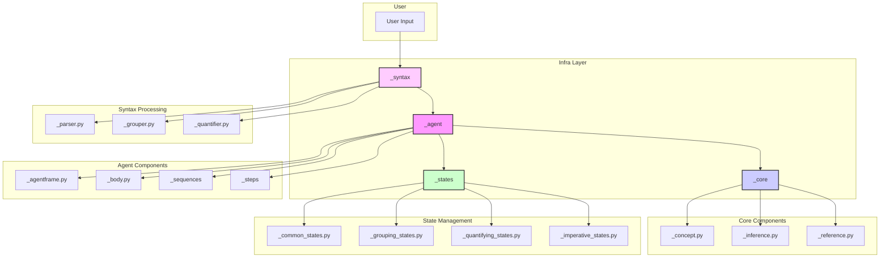
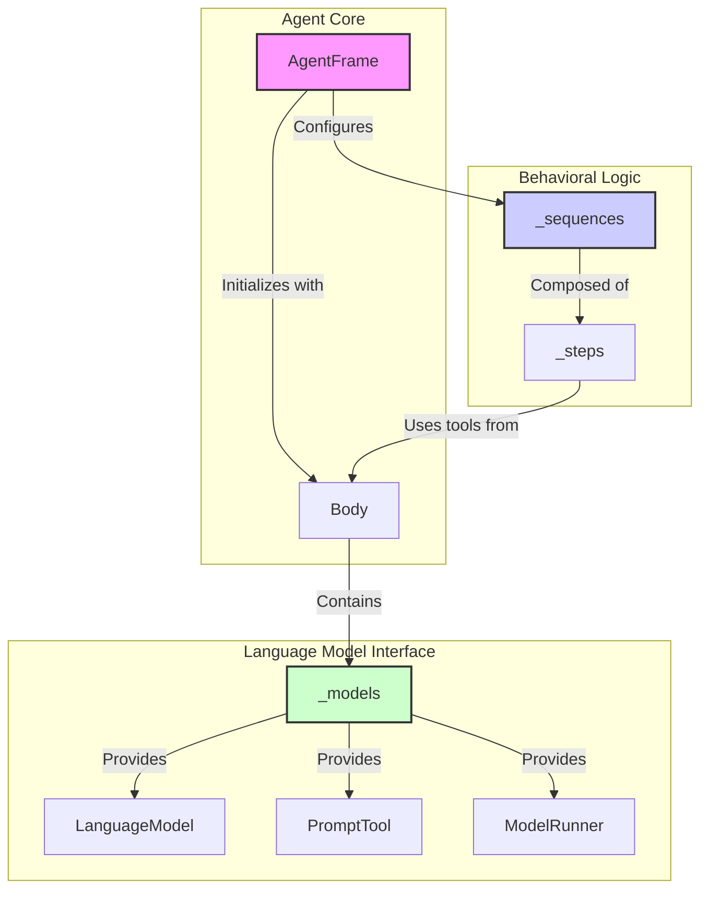

# NormCode Infrastructure (`infra`)

This directory contains the foundational framework for building and running NormCode agents. It provides a modular and extensible architecture for defining agent behavior, managing state, and processing language.

## Architecture Overview

The `infra` layer is designed with a clear separation of concerns, organized into several key components that work together to create intelligent agents. The primary components are:

- **`_agent`**: The core of the agent, responsible for its creation, configuration, and execution.
- **`_syntax`**: Handles the parsing and interpretation of input language.
- **`_core`**: Provides the fundamental data structures and inference mechanisms.
- **`_states`**: Manages the agent's internal state during its operational sequences.

Below is a diagram illustrating the high-level architecture of the `infra` directory:

## Core Components

### `_agent`

This is the central component of the `infra` layer, responsible for orchestrating the agent's behavior.

- **`AgentFrame`**: The main class that acts as a blueprint for creating agents. It initializes the agent with a specific model and sets up the necessary operational sequences.
- **`Body`**: Provides the agent with its core functionalities, including a `PromptTool` for generating prompts, a `LanguageModel` for interacting with LLMs, and a buffer for temporary data storage.
- **`_sequences`**: Defines the high-level behavioral flows of an agent, such as `simple`, `imperative`, `grouping`, and `quantifying`. Each sequence is a series of steps that guide the agent's actions.
- **`_steps`**: Contains the individual, modular actions that make up the sequences. This allows for the flexible composition of complex behaviors from simpler building blocks.

#### `_agent` Directory Architecture

> **Note**: This architecture is temporary and may be subject to change in future versions.

The `_agent` directory is the engine of the `infra` layer, providing all the necessary components to build, configure, and run agents.

- **`_agentframe.py`**: The `AgentFrame` class serves as the main controller, responsible for initializing the agent and wiring together its sequences and steps.
- **`_body.py`**: The `Body` class equips the agent with its core tools, including the language model, a prompt manager, and data buffers.
- **`_models`**: This subdirectory manages interactions with language models. The `LanguageModel` class provides a standardized interface for different LLMs, while the `prompts` folder stores prompt templates.
- **`_sequences`**: This contains the high-level logic flows that define the agent's behavior, such as `imperative.py` and `grouping.py`.
- **`_steps`**: This directory holds the individual, modular actions that make up the sequences, organized into subdirectories corresponding to their respective sequences.

### `_core`

This directory provides the fundamental data structures and mechanisms that underpin the agent's reasoning and operation.

- **`_concept.py`**: Defines the `Concept` class, a core data structure for representing abstract concepts.
- **`_reference.py`**: Implements the `Reference` class, which is used for managing and manipulating data.
- **`_inference.py`**: Contains the `Inference` class, responsible for executing the operational sequences defined in the `_sequences` directory.

### `_states`

This component is responsible for managing the agent's state throughout its lifecycle. It contains different state modules for each operational sequence, ensuring a clean separation of state logic.

- **`_common_states.py`**: Defines states that are shared across all sequences.
- **`_imperative_states.py`**: Manages the state for the imperative sequence.
- **`_grouping_states.py`**: Manages the state for the grouping sequence.
- **`_quantifying_states.py`**: Manages the state for the quantifying sequence.

### `_syntax`

This directory handles the processing and interpretation of language, allowing the agent to understand and respond to user input.

- **`_parser.py`**: Parses the input language into a structured format that the agent can work with.
- **`_grouper.py`** and **`_quantifier.py`**: Further process the parsed syntax to identify groups and quantities, respectively.

## How It Works

1.  **Input Processing**: User input is first processed by the `_syntax` component, which parses and analyzes the language to extract its meaning.
2.  **Agent Configuration**: An `AgentFrame` is instantiated with a specific model, which determines the available operational sequences. The `configure` method then links these sequences with their corresponding steps.
3.  **Inference Execution**: The `Inference` class executes a selected sequence, guiding the agent through a series of steps. During this process, the agent uses the data structures from `_core` and manages its state with `_states`.
4.  **Output Generation**: After completing the sequence, the agent produces an output based on its inference process.

For practical examples of how to use this framework, please refer to the `infra/examples` directory. 